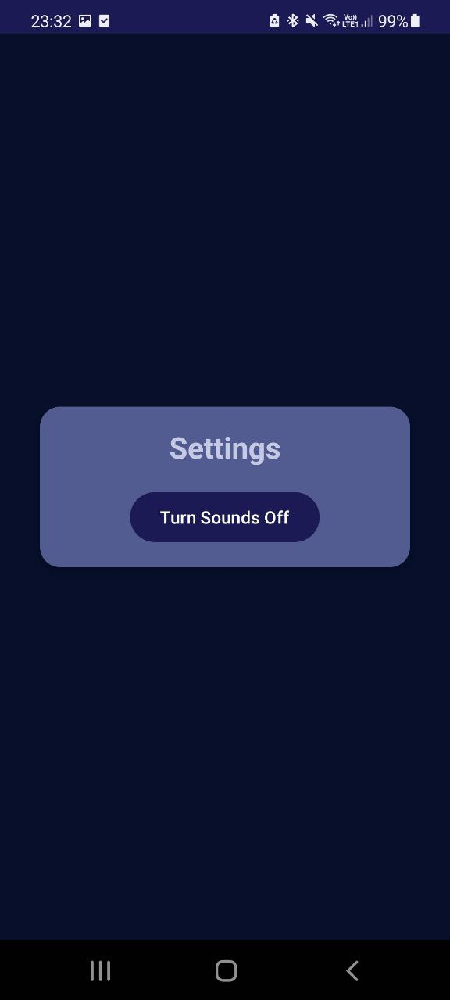

## Tic Tac Two project for Native Mobile Apps Development course

- **Full name:** Aleksandra Tremba
- **Student code:** 222966IAIB
- **School email:** altrem@taltech.ee
- **Uni-id:** altrem

## Features!
#### Very cool icon

#### Game UI
- Different screens

- Supports landscape rotation

- Gameplay screen (main activity) supports rotation AND tablet screen size. The rest are simple and responsive!

- Supports dark/light mode (system based)

- Has sounds added (different for X and O players!)

#### Database functionality
- SQLite db
- Saves game state when game is closed, and loads it when it opens again
- Statistics are saved to see how it changed over time
- Single table with just single state for every saved game

#### Gameplay
- Users play tic tac toe on 3x3 grid
- When 2 tokens from each player is placed, the grid can be moved across bigger, 5x5 grid. Moving the grid counts as a turn
- Human vs Human and Human vs Bot supported
- Bot functionality! (30% chance that he will move the grid)
- All wins are saved for statistics

#### Hope you enjoy! :)

